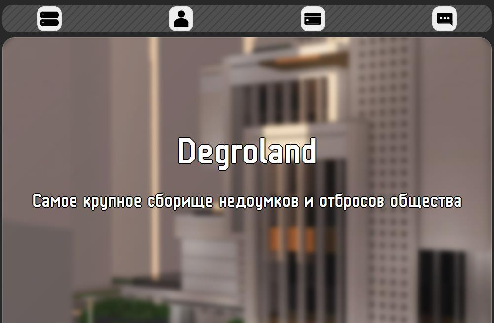

# Degroland site
OEM Degroland (i.e. my-made)

Still partially WIP

This is the reference implementation of a [Selfre / Degroland](https://selfre.cc) website

which is a successor (megre of vibecoded samples) to the old hand-made minimal website that was a successor to the very old bootstrap5-built (merge of examples)

All three are made in plain HTML + CSS (no python, no wordpress, and probably no javascript since this is myself-assembled website)

