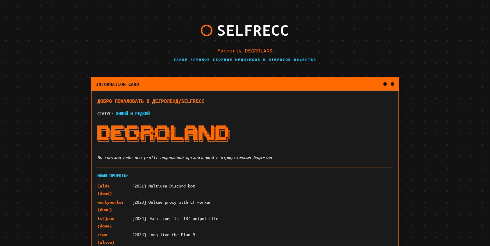

# Degroland site
OEM Degroland (i.e. my-made)

This is the reference implementation of a [Degroland](https://degroland.site) website

which is a successor to the old bootstrap5-built (merge of examples) [Old Degroland](https://old.degroland.site)

Both are made in plain HTML + CSS (no python, no wordpress, and probably no javascript since this is myself-assembled website) *except for the two widgets (official [Discord's](https://discord.com/blog/add-the-discord-widget-to-your-site/) and [Telegram's](https://core.telegram.org/widgets/post))*

